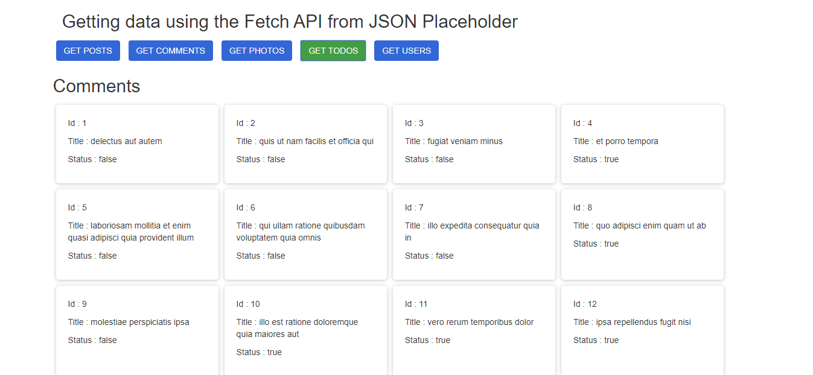

# FETCH-DATA-FROM-JSON-PLACEHOLDER-USING-FETCH-API
In this simple project am showing you can consume data from a 
remote server using the Fetch_API.

This single page app consumes data from JSON-PLACEHOLDER API, and is able to display 
- Posts
- Comments
- Photos
- Todos
- Users

Skills of displayed in this project
- Consuming data using the Fetch_API
- Working with Higher-Order Functions
- Responsive CSS design

This project is hosted on Heroku, please check it out here
[https://displaying-posts.herokuapp.com](https://displaying-posts.herokuapp.com/)

# SCREEN-SHOT

